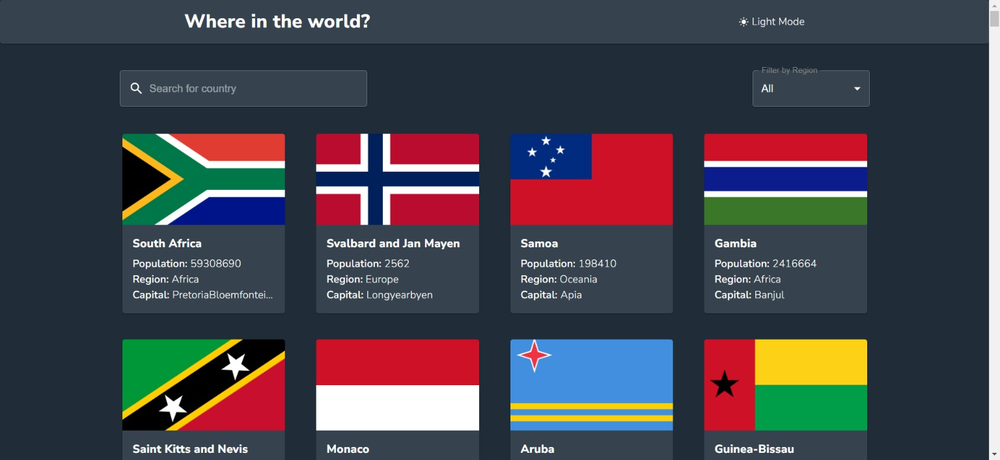

# Rest Country API- Frontend Mentor

Rest Country App is a web application built using Vite and React, provided by Frontend Mentor, that allows users to explore country information fetched from the [REST Countries API](https://restcountries.com/). The app features a user-friendly interface to search for countries, filter data by continent or region, and view detailed information about each country. It also boasts a custom Material-UI light and dark theme for a personalized user experience. The app utilizes technologies like React Router DOM, Material-UI, Axios, React Hot Toast, and React Spinners to enhance the user experience.

## Frontend Mentor

Frontend Mentor is a platform that provides real-world frontend challenges for developers to practice their skills. The Rest Country App is one of their challenges designed to improve your proficiency in React, API integration, user interface design, and theming.

## Features

- Search for countries by name.
- Filter countries by continent and region.
- Click on a country card to navigate to its detailed information page.
- User-friendly interface and responsive design.
- Real-time feedback using React Hot Toast.
- Loading spinners during data fetching.
- Custom Material-UI light and dark themes for a personalized experience.

## Dependencies

- [Vite](https://vitejs.dev/): A fast build tool for modern web development.
- [React](https://reactjs.org/): A JavaScript library for building user interfaces.
- [React Router DOM](https://reactrouter.com/web/guides/quick-start): Declarative routing for React applications.
- [Material-UI](https://mui.com/): A popular React UI framework for building responsive and attractive user interfaces.
- [Axios](https://axios-http.com/): A promise-based HTTP client for making API requests.
- [React Hot Toast](https://react-hot-toast.com/): A library for adding toast notifications to your React app.
- [React Spinners](https://www.davidhu.io/react-spinners/): A collection of loading spinners for React applications.

## Usage

- **Search**: Enter the name of a country in the search bar to find matching countries in real-time.

- **Filter**: Use the filter options to narrow down the list of countries by continent or region.

- **Country Detail**: Click on a country card to navigate to the detailed information page for that country. Here, you can find more data such as population, languages, currencies, and more.

- **Theme**: Enjoy a personalized experience with the custom Material-UI light and dark themes. Toggle between them to suit your preference.
